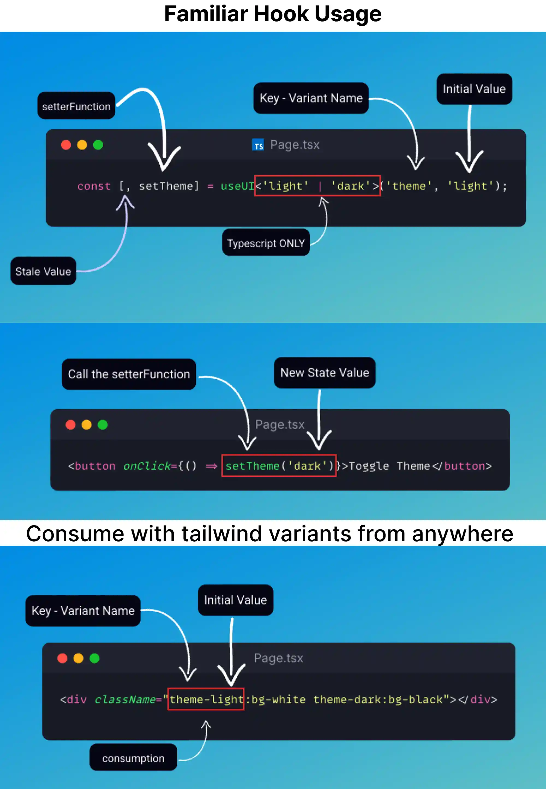

# React Zero‑UI (Beta)

**Instant UI state updates. ZERO React re‑renders. <1 KB runtime.**

Pre‑render your UI once, flip a `data-*` attribute to update — that's it.

<a href="https://bundlephobia.com/package/@austinserb/react-zero-ui@1.0.19" target="_blank" rel="noopener noreferrer"> </a><a href="https://www.npmjs.com/package/@austinserb/react-zero-ui" target="_blank" rel="noopener noreferrer"></a> <a href="https://opensource.org/licenses/MIT" target="_blank" rel="noopener noreferrer"></a> 

---

## 📚 Quick Links

- [⚡️ Quick Start](#️-quick-start)
- [🏄‍♂️ Usage](#-usage)
- [🧬 How it works](#-how-it-works)
- [✅ Features](#-features)
- [🏗 Best Practices](#-best-practices)

---

## 🚀 Live Demo

| Example                                 | Link                                                                                                                                                        | What it shows                                                 | Link to Code                                                                                                                                        |
| --------------------------------------- | ----------------------------------------------------------------------------------------------------------------------------------------------------------- | ------------------------------------------------------------- | --------------------------------------------------------------------------------------------------------------------------------------------------- |
| Interactive menu with render tracker    | <a href="https://react-zero-ui.vercel.app/" target="_blank" rel="noopener noreferrer"><strong>Main Demo↗</strong></a>                                      | Compare Zero‑UI vs. React side‑by‑side while toggling a menu. | <a href="https://github.com/Austin1serb/React-Zero-UI/tree/main/examples/demo" target="_blank" rel="noopener noreferrer">Github</a>                 |
| React benchmark (10 000 nested nodes)   | <a href="https://react-zero-ui.vercel.app/react" target="_blank" rel="noopener noreferrer"><strong>React 10k↗</strong></a>                                 | How long the traditional React render path takes.             | <a href="https://github.com/Austin1serb/React-Zero-UI/tree/main/examples/demo/src/app/react" target="_blank" rel="noopener noreferrer">Github</a>   |
| Zero‑UI benchmark (10 000 nested nodes) | <a href="https://react-zero-ui.vercel.app/zero-ui" target="_blank" rel="noopener noreferrer"><strong style="text-align: nowrap;">Zero‑UI 10k↗</strong></a> | Identical DOM, but powered by Zero‑UI's `data-*` switch.      | <a href="https://github.com/Austin1serb/React-Zero-UI/tree/main/examples/demo/src/app/zero-ui" target="_blank" rel="noopener noreferrer">Github</a> |

---

## 🧐 Why Zero‑UI?

Every `setState` in React triggers the full VDOM → Diff → Reconciliation → Paint pipeline. For _pure UI state_ (themes, menus, toggles) that work is wasted.

**Zero‑UI introduces "_PRE‑rendering_":**

1. Tailwind variants for every state are **generated at build‑time**.
2. The app **pre‑renders once**.
3. Runtime state changes only **flip a `data-*` attribute on `<body>`**.

Result → **5-10× faster visual updates** with **ZERO additional bundle cost**.

### 📊 Micro‑benchmarks (Apple M1)

| Nodes updated | React state | Zero‑UI | Speed‑up |
| ------------- | ----------- | ------- | -------- |
| 10,000        | \~50 ms     | \~5 ms  | **10×**  |
| 25,000        | \~180 ms    | \~15 ms | **12×**  |
| 50,000        | \~300 ms    | \~20 ms | **15×**  |

Re‑run these numbers yourself via the links above.

---

## ⚡️ Quick Start

> **Prerequisite:** Tailwind CSS v4 must already be initialized in your project.

```bash
# Inside an existing *Next.js (App Router)* or *Vite* repo
npx create-zero-ui
```

That's it — the CLI patch‑installs the required Babel & PostCSS plugins and updates `configs` for you.

### Manual Install

```bash
npm install @austinserb/react-zero-ui
```

Then follow **Setup →** for your bundler.

---

## 🔧 Setup

### Vite

```js
// vite.config.*
import { zeroUIPlugin } from '@austinserb/react-zero-ui/vite';

export default {
	// ❗️Remove the default `tailwindcss()` plugin — Zero‑UI extends it internally
	plugins: [zeroUIPlugin()],
};
```

### Next.js (App Router)

1. **Spread `bodyAttributes` on `<body>`** in your root layout.

   ```tsx
   // app/layout.tsx
   import { bodyAttributes } from '@austinserb/react-zero-ui/attributes';
   // or:  import { bodyAttributes } from '../.zero-ui/attributes';

   export default function RootLayout({ children }) {
   	return (
   		<html lang="en">
   			<body {...bodyAttributes}>{children}</body>
   		</html>
   	);
   }
   ```

2. **Add the PostCSS plugin (must come _before_ Tailwind).**

   ```js
   // postcss.config.js
   module.exports = { plugins: { '@austinserb/react-zero-ui/postcss': {}, tailwindcss: {} } };
   ```

---

## 🏄‍♂️ Usage



---

## 🛠 API

### `useUI(key, defaultValue)`

```ts
const [staleValue, setValue] = useUI<'open' | 'closed'>('sidebar', 'closed');
```

- `key` → becomes `data-{key}` on `<body>`.
- `defaultValue` → SSR, prevents FOUC.
- **Note:** the returned `staleValue` does **not** update (`useUI` is write‑only).

### Tailwind variants

```jsx
<div className="sidebar-open:translate-x-0 sidebar-closed:-translate-x-full" />
```

Any `data-{key}="{value}"` pair becomes a variant: `{key}-{value}:`.

---

## 🧬 How it works

1. **`useUI`** → writes to `data-*` attributes on `<body>`.
2. **Babel plugin** → scans code, finds every `key/value`, injects them into **PostCSS**.
3. **PostCSS plugin** → generates static Tailwind classes **at build‑time**.
4. **Runtime** → changing state only touches the attribute — no VDOM, no reconciliation, ZERO re‑renders.

---

## ✅ Features

- **Zero React re‑renders** for UI‑only state.
- **Global setters** — call from any component or util.
- **Tiny**: < 391 Byte gzipped runtime.
- **TypeScript‑first**.
- **SSR‑friendly** (Next.js & Vite SSR).
- **Framework‑agnostic CSS** — generated classes work in plain HTML / Vue / Svelte as well with extra config.

---

## 🏗 Best Practices

1. **UI state only** → themes, layout toggles, feature flags.
2. **Business logic stays in React** → fetching, data mutation, etc.
3. **Kebab‑case keys** → e.g. `sidebar-open`.
4. **Provide defaults** to avoid Flash‑Of‑Unstyled‑Content.

---

## 🤝 Contributing

PRs & issues welcome! Please read the [Contributing Guide](CONTRIBUTING.md).

---

## 📜 License

[MIT](LICENSE) © Austin Serb

---

Built with ❤️ for the React community. If Zero‑UI makes your app feel ZERO fast, please ⭐️ the repo!
